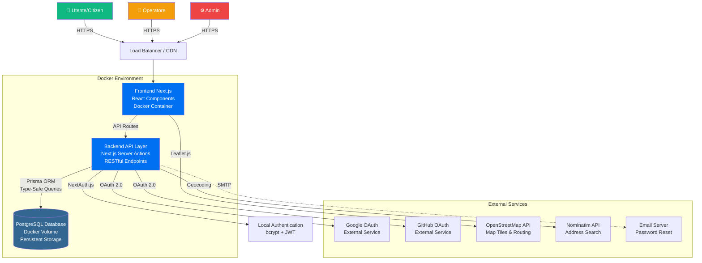
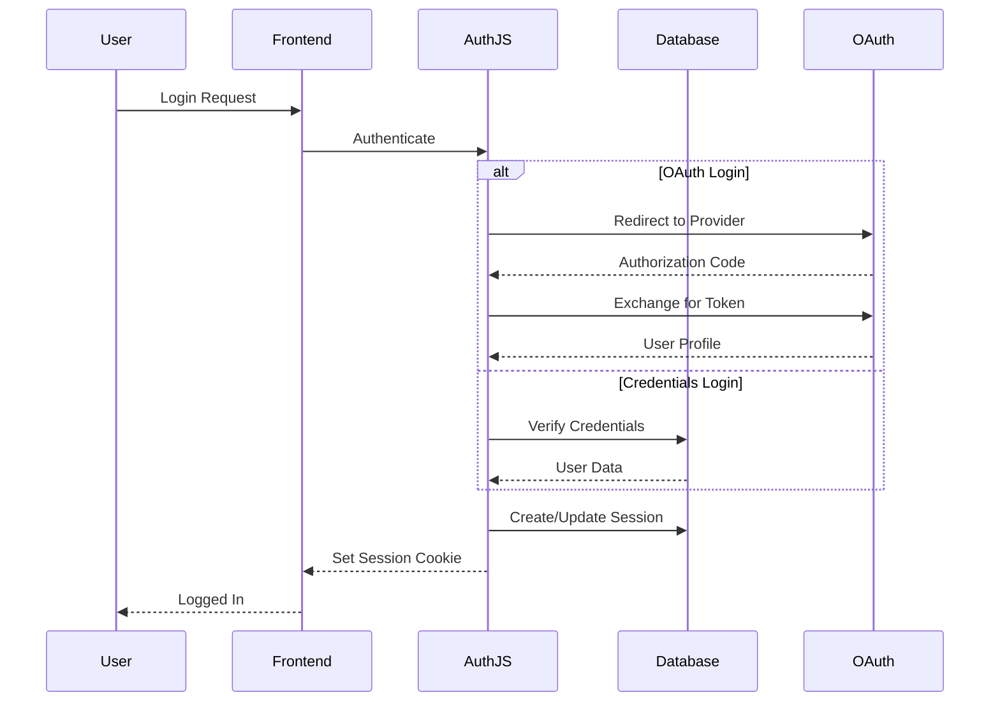
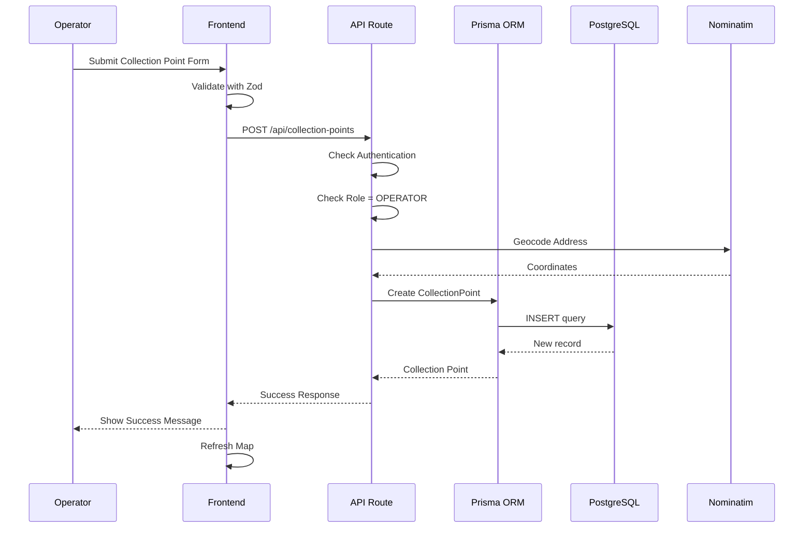
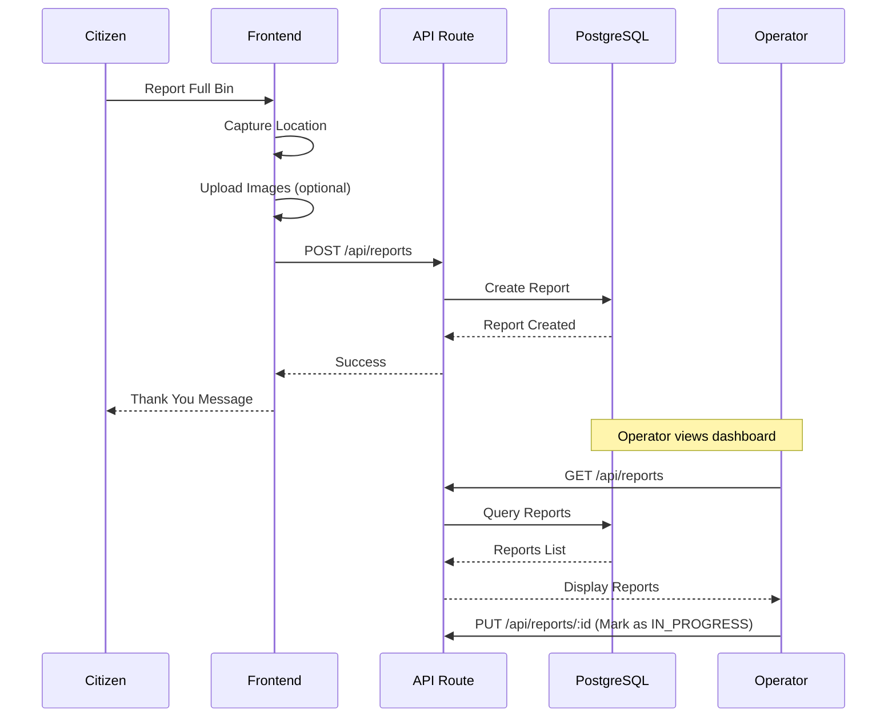
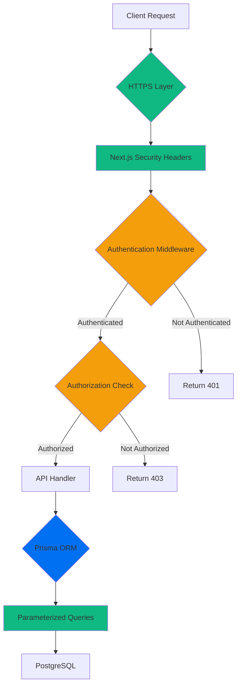
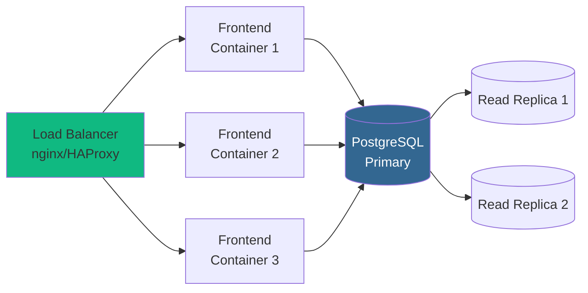

# SmartWaste - Architecture Diagram

## System Architecture Overview

This document describes the cloud-native architecture of the SmartWaste application, showing how different components interact to provide a scalable and reliable waste management system.

## High-Level Architecture



## Component Details

### 1. Frontend Layer (Next.js 15 + React 19)

**Technology Stack:**
- **Framework:** Next.js 15 with App Router
- **UI Library:** React 19
- **Styling:** Tailwind CSS 4
- **State Management:** React Hooks
- **Forms:** React Hook Form + Zod validation
- **Maps:** Leaflet.js with OpenStreetMap

**Key Features:**
- Server-Side Rendering (SSR) for SEO
- Progressive Web App (PWA) capabilities
- Responsive design for mobile and desktop
- Client-side routing with instant navigation
- Optimistic UI updates

**Container:**
- Base Image: `node:20-alpine`
- Exposed Port: `3000`
- Health Check: `/api/health`
- Non-root user execution for security

### 2. Backend Layer (Next.js API Routes)

**Technology Stack:**
- **API Framework:** Next.js API Routes (RESTful)
- **ORM:** Prisma 6.5 (Type-safe database access)
- **Authentication:** Auth.js (NextAuth v5)
- **Password Hashing:** bcryptjs
- **Validation:** Zod schemas

**API Endpoints:**
```
POST   /api/auth/signin          - User login
POST   /api/auth/signup          - User registration
GET    /api/collection-points    - List collection points
POST   /api/collection-points    - Create collection point (Operator)
GET    /api/collection-points/:id - Get specific point
PUT    /api/collection-points/:id - Update point (Operator)
DELETE /api/collection-points/:id - Delete point (Admin)
POST   /api/reports              - Create report
GET    /api/reports              - List reports
PUT    /api/reports/:id          - Update report status (Operator)
GET    /api/map                  - Map data for visualization
POST   /api/nominatim            - Geocoding service proxy
GET    /api/health               - Health check endpoint
```

**Authentication Flow:**


### 3. Database Layer (PostgreSQL 16)

**Schema Overview:**

```
Users (Authentication & Profile)
├── id (UUID)
├── email (unique)
├── password (hashed with bcrypt)
├── role (USER | OPERATOR | ADMIN)
├── name, surname, cellphone
└── OAuth provider info

Operators (Organization Info)
├── userId (FK to Users)
├── organizationName
├── vatNumber
├── telephone
└── website

CollectionPoints (Waste Collection Sites)
├── id
├── operatorId (FK to Operators)
├── name, description
├── wasteTypes (Many-to-Many)
├── schedule (One-to-One)
├── address (One-to-One with coordinates)
├── isActive
├── accessibility, capacity
└── images (JSON)

WasteTypes (Categories of Waste)
├── id
├── name (e.g., "Plastica", "Vetro")
├── description
├── color (for map markers)
├── iconName
└── disposalInfo

Reports (Citizen Reports)
├── id
├── userId (FK to Users)
├── collectionPointId (FK)
├── type (FULL_BIN | DAMAGED | etc.)
├── description
├── status (PENDING | IN_PROGRESS | RESOLVED)
└── images (JSON)
```

**Persistence:**
- Docker Named Volume: `smartwaste_postgres_data`
- Automatic backups recommended for production
- No bind mounts to ensure portability

### 4. External Services Integration

**OpenStreetMap (Leaflet.js):**
- Purpose: Interactive maps and tile rendering
- Integration: Client-side JavaScript library
- Cost: Free and open-source

**Nominatim API:**
- Purpose: Geocoding and reverse geocoding
- Integration: Server-side API proxy
- Rate Limiting: Implemented to respect usage policy

**OAuth Providers:**
- Google OAuth 2.0: Social login
- GitHub OAuth 2.0: Developer-friendly login
- Configuration: Environment variables

## Data Flow Examples

### Creating a Collection Point (Operator)



### Reporting an Issue (Citizen)



## Security Architecture

### Multi-Layer Security



**Security Measures:**

1. **Transport Security:**
   - HTTPS only in production
   - Secure cookies (httpOnly, secure, sameSite)
   - HSTS headers

2. **Authentication:**
   - bcrypt password hashing (10 rounds)
   - JWT session tokens
   - OAuth 2.0 for social login
   - Session expiration and renewal

3. **Authorization:**
   - Role-Based Access Control (RBAC)
   - Middleware for route protection
   - Resource ownership validation

4. **Data Security:**
   - SQL injection prevention (Prisma parameterized queries)
   - XSS protection (React auto-escaping)
   - CSRF protection (Auth.js built-in)
   - Input validation (Zod schemas)

5. **Container Security:**
   - Non-root user execution
   - Minimal Alpine Linux base
   - No secrets in images
   - Regular security updates

## Scalability & Performance

### Horizontal Scaling Strategy



**Performance Optimizations:**

1. **Frontend:**
   - Static generation where possible
   - Image optimization (AVIF, WebP)
   - Code splitting and lazy loading
   - CDN for static assets

2. **Backend:**
   - Database query optimization
   - Caching strategies (Redis future)
   - Connection pooling (Prisma)

3. **Database:**
   - Indexed columns for frequent queries
   - Read replicas for scaling reads
   - Regular VACUUM and ANALYZE

## Monitoring & Observability

**Health Checks:**
- Application: `GET /api/health`
- Database: PostgreSQL `pg_isready`
- Container: Docker healthcheck

**Logging:**
- Application logs to stdout/stderr
- Docker logs aggregation
- Structured logging format (JSON)

**Metrics (Future):**
- Response times
- Error rates
- Database query performance
- Resource utilization

## 12-Factor App Compliance

| Factor | Implementation |
|--------|----------------|
| **I. Codebase** | Single Git repository, multiple deployments |
| **II. Dependencies** | Explicitly declared in `package.json`, isolated in containers |
| **III. Config** | Environment variables (`.env` files) |
| **IV. Backing Services** | Database as attached resource via `DATABASE_URL` |
| **V. Build, Release, Run** | Separate stages in Docker multi-stage build |
| **VI. Processes** | Stateless app, sessions in database |
| **VII. Port Binding** | Self-contained, exports HTTP via port 3000 |
| **VIII. Concurrency** | Horizontal scaling via container replication |
| **IX. Disposability** | Fast startup (<40s), graceful shutdown |
| **X. Dev/Prod Parity** | Docker ensures identical environments |
| **XI. Logs** | Stdout/stderr, aggregated by Docker |
| **XII. Admin Processes** | Scripts in `/scripts`, run as one-off containers |

## Technology Decisions & Rationale

### Why Next.js?
- **Full-stack framework:** Combines frontend and backend in one codebase
- **SEO-friendly:** Server-Side Rendering for search engines
- **Performance:** Automatic code splitting, image optimization
- **Developer Experience:** Hot reload, TypeScript support
- **Production-ready:** Used by Vercel, Netflix, TikTok

### Why PostgreSQL over SQLite?
- **Scalability:** Handles concurrent writes better
- **ACID compliance:** Stronger data integrity guarantees
- **Advanced features:** Full-text search, JSON support, replication
- **Cloud-native:** Available as managed service (AWS RDS, Azure Database, etc.)
- **Production standard:** Industry-proven for web applications

### Why Docker?
- **Consistency:** "Works on my machine" → "Works everywhere"
- **Isolation:** Dependencies don't conflict with host system
- **Portability:** Deploy anywhere (AWS, Azure, Railway, local)
- **Scalability:** Easy to replicate and orchestrate
- **CI/CD:** Simplified build and deployment pipeline

### Why Prisma ORM?
- **Type Safety:** Generated TypeScript types from schema
- **Developer Experience:** Intuitive API, great autocomplete
- **Database Agnostic:** Easy to switch databases if needed
- **Migrations:** Built-in migration system
- **Performance:** Efficient query generation

## Deployment Environments

### Local Development
- SQLite for quick setup (optional)
- Docker Compose for full stack
- Hot reload for rapid development

### Staging/Testing
- Docker Compose with PostgreSQL
- Separate database from production
- CI/CD automatic deployment

### Production
- Container orchestration (Kubernetes, ECS, etc.)
- Managed PostgreSQL (RDS, Azure Database)
- CDN for static assets
- Load balancer for high availability
- Monitoring and alerting
- Automated backups

## Future Enhancements

**Short Term:**
- Redis for session storage and caching
- Elasticsearch for advanced search
- Automated database backups
- Prometheus metrics

**Long Term:**
- Microservices architecture (if needed)
- Real-time notifications (WebSockets)
- Mobile native apps (React Native / Capacitor)
- Machine learning for waste categorization
- API rate limiting and throttling

---

**Document Version:** 1.0  
**Last Updated:** January 2026  
**Maintained By:** SmartWaste Team
